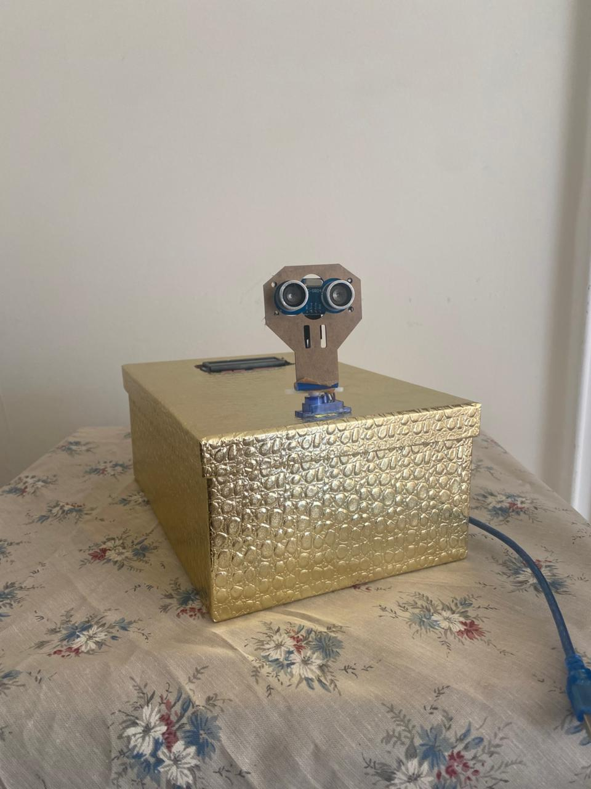
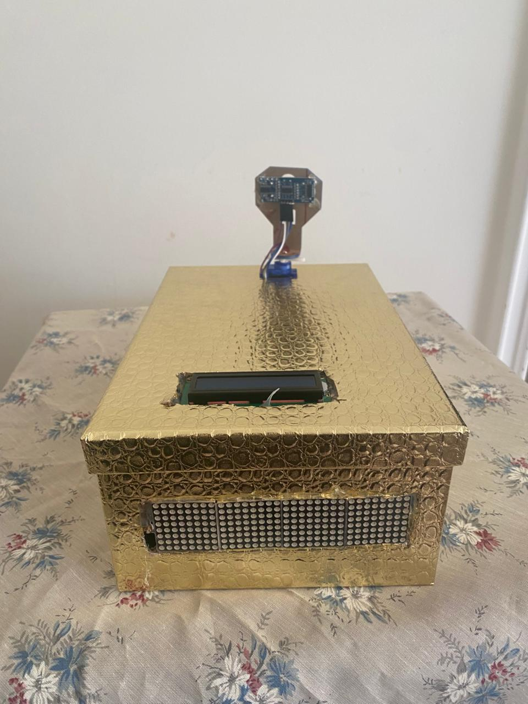

# arduino-radar-system
Arduino-based radar system using ultrasonic sensor and servo motor for real-time object detection and visualization
# Arduino Radar System

## 📌 Overview
This project is an object detection radar system built using an ultrasonic sensor and a servo motor.  
It scans the environment, measures distances, and displays real-time data on an LCD screen and LED matrix.

---

## ⚙️ Features
- Distance measurement using ultrasonic sensor (HC-SR04)
- 180° scanning using servo motor
- Real-time display on LCD
- Object position visualization on LED matrix

---

## 🛠️ Technologies Used
- Arduino (C/C++)
- Ultrasonic Sensor (HC-SR04)
- Servo Motor (SG90)
- I2C LCD Display
- LED Matrix (MAX7219)

---

## ▶️ How it works
1. Servo rotates from 0° to 180°
2. Sensor measures distance at each angle
3. Data is displayed in real-time

---

## 📷 Project Preview

---

## 👩‍💻 Author
Joanna Mouawad
